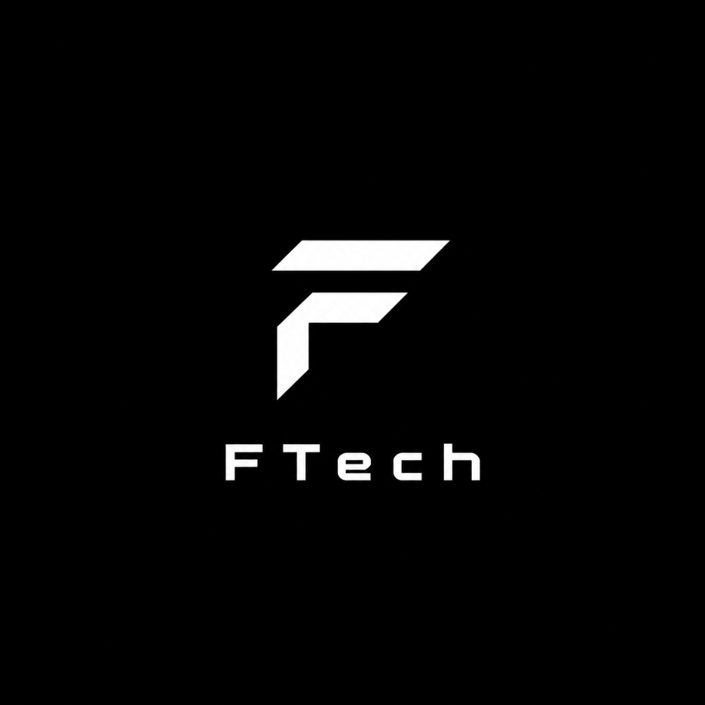

<p align="center">
  
</p>

<h1 align="center">⚡ FTool</h1>

<p align="center">
  <b>Futuristic All-in-One Coding & Machine Learning Studio for Windows</b><br>
  <i>Designed for everyone: effortless for beginners, powerful for engineers.</i>
</p>

<p align="center">
  
  
  
  
</p>

---

## 🌟 Philosophy

Most developer and machine learning tools today fall into one of two extremes:
1. **Oversimplified** tools that lack real capabilities and real-world usefulness.
2. **Overcomplicated** terminal tools with intimidating flags, manual pip dependencies, and opaque output formats that overwhelm newcomers.

**FTool changes that.** Built with a clean, minimalist, and futuristic interface, FTool puts complex machine learning pipelines, AST parsers, computer vision filters, and developer toolkits behind intuitive, readable, one-click controls. **The program does the heavy lifting, while you stay in full control.**

---

## ✨ Key Features

### 1. 🎬 3-Second Seamless Splash Screen
- Smooth, animated fade-in and fade-out splash screen featuring the **FTech** emblem and real-time core initialization progress.

### 2. 🤖 Machine Learning Studio (Zero-Code to Pro)
- **Auto-EDA**: Instant dataset shape, data types, missing value audit, and summary statistics.
- **Built-in Datasets**: Explore *Iris (Classification)*, *Customer Churn*, *Wine*, or *Diabetes (Regression)* with 1 click.
- **Custom Uploads**: Supports `.csv`, `.json`, `.xlsx`, and `.xls`.
- **Model Training**: Train Random Forest, Gradient Boosting, SVM, Logistic Regression, or KNN with real-time test/train splits.
- **Visual Diagnostics**: Interactive Confusion Matrix heatmaps and Feature Importance bar charts rendered natively.
- **Live Inference Sandbox**: Adjust inputs on the fly to get instant predictions and confidence probabilities.
- **Python Code Generator**: Export clean, standard Python scripts replicating the exact model pipeline.
- **Model Export**: Save models as `.joblib` files ready for deployment.

### 3. 💻 Python Code Studio & AST Inspector
- Built-in futuristic code editor with line numbering and Python syntax highlighting.
- **Sub-millisecond Runner**: Isolated thread execution with captured `stdout`, `stderr`, and precise latency benchmarking.
- **AST Inspector**: Breaks down code structure into functions, argument lists, docstrings, classes, and imported modules.
- **Preset Library**: Ready-to-run templates for Data Science, Algorithms, and Quickstarts.

### 4. 👁️ Computer Vision Sandbox
- Interactive OpenCV image processing lab with side-by-side comparison viewports.
- Real-time filters: **Canny Edge Detection**, **Gaussian Blur**, **Binary & Adaptive Thresholding**, **Contour Extractor**, and **Cyber Colormaps (Jet, Ocean, Hot)**.
- Adjustable parameter sliders with instant preview and one-click image export.

### 5. 📝 NLP & Sentiment Intelligence
- Real-time text sentiment polarity and subjectivity analysis.
- **Flesch Reading Ease** readability scoring.
- Automated keyword frequency extraction and token statistics.
- **Semantic Text Similarity**: Cosine similarity calculation between two text passages using TF-IDF vectorization.

### 6. 🛠️ Dev Utilities & Swiss-Army Knife
- **Regex Sandbox**: Test patterns with flags, view matched tokens, character spans, and capture groups.
- **HTTP / Webhook Tester**: Test `GET`, `POST`, `PUT`, `DELETE` endpoints with custom payloads, status code badges, and latency benchmarks.
- **Encoders & Crypto Hashes**: Base64, MD5, SHA-256, URL encode/decode, Hex, and instant JWT token decoders.
- **JSON Beautifier**: Format and validate nested JSON structures.

### 7. ⚡ Guided Workflow Runner
- Automate complex CLI workflows with zero terminal fuss:
  - Python runtime diagnostics and environment audit.
  - Local port scanner (`3000`, `5000`, `8000`, `8080`) to check running web services.
  - Git repository quick status and commit logs.
  - Outdated pip package checker.
  - Custom command console with styled output logging.

---

## 🚀 Getting Started

### Prerequisites
- Windows 10 or Windows 11
- Python 3.10+ installed ([python.org](https://www.python.org/))

### Installation
```bash
# 1. Clone the repository
git clone https://github.com/your-username/FTool.git
cd FTool

# 2. Install dependencies
pip install -r requirements.txt

# 3. Launch FTool
python main.py
```
*(Or simply double-click `run.bat` on Windows)*

---

## 📦 Packaging Standalone Windows Executable (.exe)

FTool includes an automated PyInstaller builder:

```bash
python build_exe.py
```
*(Or simply double-click `build.bat`)*

The standalone compiled executable will be generated at:
```
dist/FTool/FTool.exe
```

---

## 📁 Project Structure

```
FTool/
├── assets/
│   ├── logo.png               # FTech Emblem Logo
│   └── app_icon.ico           # Windows Application Icon
├── ftool/
│   ├── __init__.py
│   ├── config.py              # Futuristic Cyber Theme, QSS, Palettes
│   ├── core/
│   │   ├── ml_engine.py       # Scikit-learn training, EDA, and export
│   │   ├── cv_engine.py       # OpenCV filter pipelines
│   │   ├── code_engine.py     # Code execution, AST analysis, regex, HTTP
│   │   ├── nlp_engine.py      # Sentiment, readability, and similarity
│   │   └── utils.py           # System resource monitor (CPU, RAM, Disk)
│   └── ui/
│       ├── components.py      # Custom Cards, Buttons, DarkPlotCanvas, Highlighters
│       ├── splash.py          # 3-Second animated fade splash screen
│       ├── main_window.py     # Window chrome, sidebar, and tab stack
│       └── tabs/
│           ├── tab_dashboard.py
│           ├── tab_ml_studio.py
│           ├── tab_code_studio.py
│           ├── tab_cv_sandbox.py
│           ├── tab_nlp_tools.py
│           ├── tab_dev_tools.py
│           └── tab_runner.py
├── tests/                     # Automated engine and GUI verification suite
├── main.py                    # Entry point
├── build_exe.py               # PyInstaller packaging script
├── run.bat                    # One-click Windows runner
├── build.bat                  # One-click Windows compiler
├── requirements.txt           # Project dependencies
├── LICENSE                    # MIT License
└── README.md                  # Project documentation
```

---

## 👤 Credits & Author

- **Author & Design**: **FTech**
- **Repository**: Open-source on GitHub under the **MIT License**.
